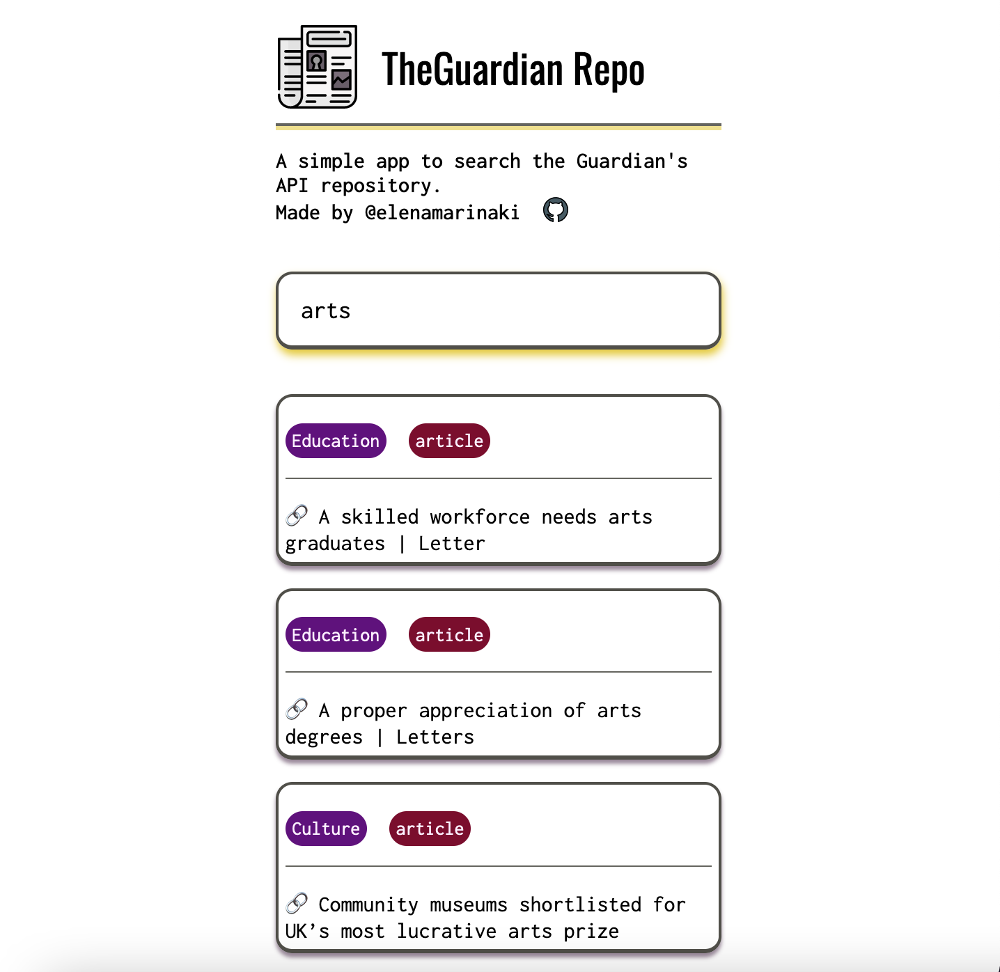

# TheGuardian Repo 📰

This is a simple application that uses the Guardian's API to search for keywords. All results are articles from the Guardian's website.

### How to run the application 🎲
- The user types a word of interest, based on what they want to search the newspaper and presses `Enter`.
- The application asks the API for relevant articles that include or are related to the keyword given.

### How it works ♟️
- As a general search, the API returns an array of 10 related articles. These are the 10 articles that appear on page, each one on a different box.
- Each box article is brought to page through the `<template>`.
- These articles can be under different categories, so I have added `tags` in each template that reveal information of the category each article belongs to.

